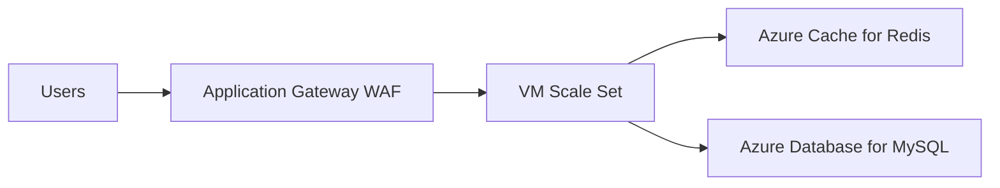
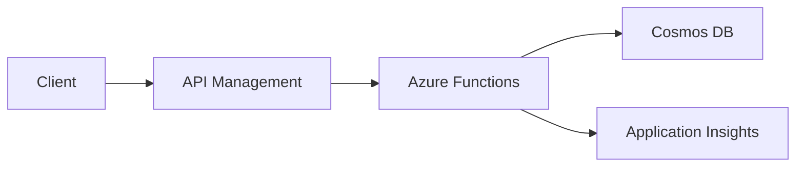
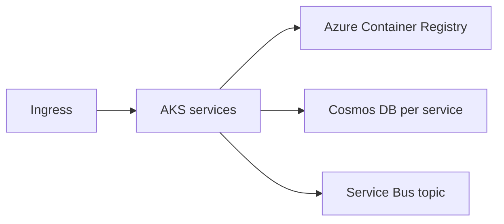
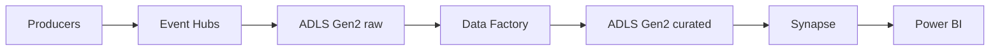
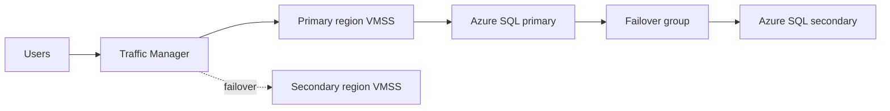

# Azure Architecture Diagrams

## Three-Tier Web

```mermaid
flowchart LR
  user["Users"] --> agw["Application Gateway WAF"]
  agw --> vmss["VM Scale Set"]
  vmss --> redis["Azure Cache for Redis"]
  vmss --> mysql["Azure Database for MySQL"]
```

## Serverless API

```mermaid
flowchart LR
  client["Client"] --> apim["API Management"]
  apim --> func["Azure Functions"]
  func --> cosmos["Cosmos DB"]
  func --> appi["Application Insights"]
```

## Microservices on AKS

```mermaid
flowchart LR
  ingress["Ingress"] --> aks["AKS services"]
  aks --> acr["Azure Container Registry"]
  aks --> cosmos["Cosmos DB per service"]
  aks --> sb["Service Bus topic"]
```

## Data Lake / Analytics

```mermaid
flowchart LR
  producers["Producers"] --> eventhub["Event Hubs"]
  eventhub --> raw["ADLS Gen2 raw"]
  raw --> adf["Data Factory"]
  adf --> curated["ADLS Gen2 curated"]
  curated --> synapse["Synapse"]
  synapse --> powerbi["Power BI"]
```

## Multi-Region DR

```mermaid
flowchart LR
  users["Users"] --> tm["Traffic Manager"]
  tm --> primary["Primary region VMSS"]
  tm -. failover .-> secondary["Secondary region VMSS"]
  primary --> sql["Azure SQL primary"]
  sql --> fog["Failover group"]
  fog --> sql2["Azure SQL secondary"]
```
